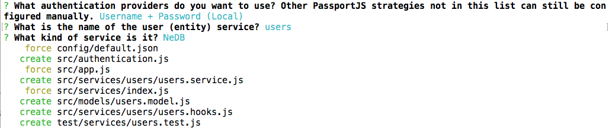

Add authentication
==================

In the previous chapters we :doc:`./service` for storing messages. For a proper chat
application we need to register and authenticate users.

Generate authentication
-----------------------

To add authentication to our application, we can run

::

   feathers generate authentication

This first asks which authentication providers we’d like to use. In this
guide, we’ll only cover local authentication. It should be selected by
default. Press enter.

Next we have to define the service we’ll use to store user information.
Simply confirm the default ``users``, then the default NeDB database:

   Final Configuration

..

.. note:: For details on Feathers authentication see the
   :doc:`../../api/authentication/server`.

Create a user and log in
------------------------

We just created a ``users`` service and enabled local authentication.
When restarting the application, we can now create a new user with
``email`` and ``password``, similar to what we did with messages. The
login information is then processed into a JWT (JSON Web Token). (For
more information see the :doc:`../auth/how-jwt-works`).

Create the user
~~~~~~~~~~~~~~~

We will create a new user with the following data:

::

   {
     "email": "feathers@example.com",
     "password": "secret"
   }

The generated user service automatically securely hashes the password in
the database, and exclude it from the response. (Passwords should never
be transmitted back to clients). There are several ways to create a new
user, for example, via CURL:

::

   curl 'http://localhost:3030/users/' -H 'Content-Type: application/json' --data-binary '{ "email": "feathers@example.com", "password": "secret" }'

With a REST client,
e.g. \ `Postman <https://chrome.google.com/webstore/detail/postman/fhbjgbiflinjbdggehcddcbncdddomop?hl=en>`_
using this button:

|Run in Postman|

.. note:: Creating a user with the same email address will only work
   once, then fail since it already exists in the database. This is a
   restriction implemented for NeDB; it might have to be implemented
   manually when using a different database.

Get a token
~~~~~~~~~~~

To create a JWT, we can now post the login information to the
``authentication`` service, with the desired strategy (``local``):

::

   {
     "strategy": "local",
     "email": "feathers@example.com",
     "password": "secret"
   }

Via CURL:

::

   curl 'http://localhost:3030/authentication/' -H 'Content-Type: application/json' --data-binary '{ "strategy": "local", "email": "feathers@example.com", "password": "secret" }'

With a REST client,
e.g. \ `Postman <https://chrome.google.com/webstore/detail/postman/fhbjgbiflinjbdggehcddcbncdddomop?hl=en>`_:

|Run in Postman|

The returned token can then be used to authenticate this specific user,
by adding it to the ``Authorization`` header of new HTTP requests. Since
we will also use Feathers on the client when creating a frontend, we
don’t have to worry about manually creating and using the token for this
guide. For more information for authenticating REST API calls see the
:doc:`../../api/client/rest#authentication`.

Securing the messages service
-----------------------------

Let’s restrict our messages service to authenticated users. If we had
run ``feathers generate authentication`` *before* generating other
services, ``feathers generate service`` would have asked if the service
should be restricted to authenticated users. However, since we created
the messages service first, we now have to update
``src/services/messages/messages.hooks.js`` manually to look like this:

.. code:: js

   const { authenticate } = require('@feathersjs/authentication').hooks;

   module.exports = {
     before: {
       all: [ authenticate('jwt') ],
       find: [],
       get: [],
       create: [],
       update: [],
       patch: [],
       remove: []
     },

     after: {
       all: [],
       find: [],
       get: [],
       create: [],
       update: [],
       patch: [],
       remove: []
     },

     error: {
       all: [],
       find: [],
       get: [],
       create: [],
       update: [],
       patch: [],
       remove: []
     }
   };

That way, only users with a valid JWT can access the service. This also
automatically sets ``params.user`` only for authenticated users.

Securing real-time events
-------------------------

The ``authenticate`` hook introduced above restricts *access* to service
methods, to authenticated users. We also need to ensure that :doc:`../basics/real-time` are only sent to connections
allowed to see them - for example when users join a specific chat room
or one-to-one messages.

Feathers uses ``channels`` to accomplish that. The generator already
sets them in ``src/channels.js``. (Have a look at the comments in the
generated file and the :doc:`../../api/channels` to get a better idea about
channels).

By default ``src/channels.js`` is set up to send *all* events to all
*authenticated* users which is what we will use for our chat
application.

What’s next?
------------

In this chapter, we initialized authentication, created a user and JWT.
We secured the messages service and made sure that only authenticated
users get real-time updates. We can now use that user information to
:doc:`./processing`.

.. |Run in Postman| image:: https://run.pstmn.io/button.svg
   :target: https://app.getpostman.com/run-collection/9668636a9596d1e4a496
